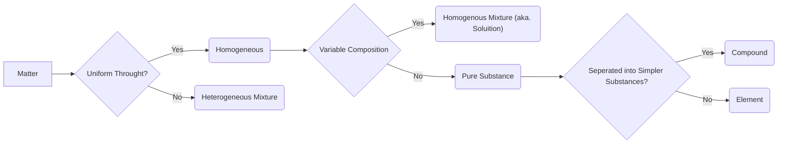

# Basic Chemistry (`CHEM1007.4`)

> Marmara University School of Engineering
> Course credit: 6 ACTS 
> Course Lecturer: Dr. Özge Kerkez Kuyumcu
> Last Updated: Dec, 31 2020. 
>
> Note: Wx stands for xth week's lesson.

> Document created by Gökhan Koçmarlı
> from teacher's slides and himself's notes
> with using Markdown, Typora, LaTeX/
> MathJAX, mhcem. Also, used theme is named
> as "Paper" in the Typora store.

> [TOC]
> 

---
<div style="page-break-after: always;"></div>

### Translations of Terms

| English              | Turkish                          |
| -------------------- | -------------------------------- |
| Compound             | Bileşik                          |
| Intensive Properties | Maddeye özgü özellikler          |
| Extensive Properties | Maddeye özgü olmayan özellikler  |
| Derived Units        | Türetilmiş Büyüklükler           |
| Substance            | Madde                            |
| Flask                | Şişe                             |
| Accuracy             | Doğruluk                         |
| Precision            | Hassaslık                        |
| Solubility           | Çözünebilirlik                   |
| Spontaneous          | Kendiliğinden olan               |
| Limiting Reactant    | Sınırlayıcı Bileşen              |
| Combustion Reactions | Yanma Tepkimeleri                |
| Yield                | Verim                            |
| Electron promotion   | Elektron atlaması (üst seviyeye) |
| Electron demotion    | Elektron düşmesi (alt seviyeye)  |
| Solute               | Çözünen                          |
| Solvent              | Çözücü                           |
| Restrain             | Ölçülemek, Tutmak, Sınırlamak    |
| Saturated            | Doymuş                           |
| Semipermeable        | Yarı geçirgen                    |
| Crenation            | Plazmoliz                        |
| Hemolysis            | Deplazmoliz                      |

---
<div style="page-break-after: always;"></div>

## W1 | Introduction: Matter and Measurement

* Chemistry is a science which is interested in matter and their properties. Matter is defined as anything that has a mass and takes up space.

  | Type of Matter                    | Description                                  |
  | --------------------------------- | -------------------------------------------- |
  | Atoms of an element               | Only one kind of atom in any element.        |
  | Molecules of an element           | Only one kind of atom in any element.        |
  | Molecules of  a compound          | Must have at least two kinds of atoms.       |
  | Mixture of elements and compounds | At least two types of elements or compounds. |

* Classification of matters and how to find the type of any matter can be represented with this diagram: 

* There are types of properties: Intensive and Extensive. **Intensive properties** are independent from the amount of the substance but **extensive** ones are dependent. Density, boiling point, colour are intensive; mass, volume, energy is extensive.

* There are two types of changes: Physical and Chemical. Physical change doesn't affect the composition of a substance but chemical changes does, they make new substances. Therefore chemical reaction means a reaction which creates new substances.
<br>
  | Separation Types | Mixtures or Description                                      |
  | ---------------- | ------------------------------------------------------------ |
  | Filtration       | Solid substances from liquids or solutions                   |
  | Distillation     | Homogeneous mixture into its components with difference in their boiling points |
  | Chromatography   | Separation substances on the basis of differences in solubility in a solvent. |
<br>

* SI units are these:
<br>
  | Physical Quantity   | Abbreviation and Name of Unit |
  | ------------------- | ----------------------------- |
  | Mass                | Kilogram --- kg               |
  | Length              | Meter --- m                   |
  | Time                | Second --- sec or s           |
  | Temperature         | Kelvin --- K                  |
  | Amount of substance | Mole --- mol                  |
  | Electric current    | Ampere --- A or amp           |
  | Luminous intensity  | Candela --- cd                |
<br>
* 1 liter is a cube 1 decimeter long on each side. So 1 liter = 1 decimeter cube.

* Celsius and Kelvin relation: _K = C* + 273.15_

* **Significant figures** rules: (0.004004500 -> 40045 significant ones)

  * All nonzero digits are significant.
  * Zeroes between two significant figures are themselves significant.
  * Zeroes at the beginning of a number are never significant.
  * Zeroes at the end of a number significant if a decimal point is written in the number.

* When addition is performed, answers are rounded to the least significant decimal place. In multiplication, answer's digit number must be same as the number of digits in least element.

* **Accuracy** refers to the proximity of measurement to the true value of a quantity. **Precision** refers to the proximity of several measurements to each other.

<div style="page-break-after: always;"></div>

## W1 | Atoms, Molecules and Ions

* **Dalton's Postulates**
1. Each element is composed of extremely small particles called atoms.
  2. All atoms of a given element are identical but the atoms of one element are different from the atoms of all other elements.
  3. Atoms of one element cannot be changed into atoms of a different element by chemical reactions; atoms are neither created nor destroyed in chemical reactions.
  4. Compounds are formed when atoms of more than one element combine; a given compound always has the same relative number and kind of atoms.
* **Law of Conservation of Mass:** The total mass before the reaction is the same as the total mass after the reaction.
* **Law of Constant Composition:** In a compound, the relative numbers and kinds of atoms are constant.
* **Law of Multiple Proportions:** If two elements A and B combine to form more than one compound, the masses of B can combine with a given mass of A are in the ratio of small whole numbers.
* Electrons are discovered in 1897 by J. J. Thomson. Streams of negatively charged particles were found to emanate from cathode tubes, causing fluorescence then named as electrons.
* Cathode is the negative side (leaving side) and anode is the positive side (entering side).
* Thomson measured the charge/mass ratio the electron to be $1.76 * 10^8 \frac{C}{g}$
* **Millikan's Oil-Drop Experiment:** Once the charge/mass ratio of the electron was known, determination of either the charge or the mass of an electron would yield the other. This experiments has found the charge of electron as $1.602 * 10 ^ {-19} C $
* In 1896, Henri Becquerel discovered that a compound of uranium spontaneous emits high-energy radiation. **Radioactivity** is the spontaneous emission of radiation of an atom.
* There are three types of radiation which are discovered by Rutherford:
  * $\alpha$ particles: $\ce{He^2+}$
  * $\beta$ particles: A high-energy, high-speed electron or positron emitted by the radioactive decay of an atomic nucleus during the process of beta decay. There are two forms of beta decay, β− decay and β+ decay, which produce electrons and positrons respectively.
  * $\gamma$ rays
<br>
| **Atom Models**    |                                                              |
| ------------------ | ------------------------------------------------------------ |
| Thomson's Model    | * Seeds in a watermelon <br />* Positive charge spread throughout sphere<br />* Negative electrons embedded in sphere<br />* Rutherford and Marsden proved this model wrong |
| Rutherford's Model | * A particle gun experiment (golden foil exp.)<br />* Discovery and first seen of dense nucleus<br />* A atom contains lots of empty space<br /> |
<br>
* After that proton has discovered by Rutherford and neutron has discovered by Chadwick.

* Protons and electrons are the only particles that have a charge. Protons and neutron nearly has the same mass but electrons are nothing besides them.

* **Isotope** means same elements with different masses because of neutrons.

* Atomic mass unit is extremely useful when we're dealing with really low masses. 1 atomic mass unit is equals to mass of the unbound $\ce{^{12}C}$ atom. 

* **Average mass** is calculated from the isotopes of an element weighted by their relative abundances.
  $$
  average\ weight = \sum (isotope * \frac{isotope\ abundace}{abundance\ of\ the\ element})
  $$

* There are two types of formulas: **empirical formula** and **molecular formula**. Empirical formulas give the lowest whole-number ratio of atoms of each element in a compound. Molecular formulas give the exact number of atoms of each element in a compound. Also, structural formulas show the order in which atoms are bonded but perspective drawings also show the three-dimensional array of atoms in a compound.
* When atoms lose or gain electrons they become **ions**:
  * If it gains electrons it'll be anode.
  * If it lose electrons it'll be cathode.
* Ionic compounds can be made by ionic bonds.

* **Oxidation number**: the electron number which an atom gives or takes when become compound. Rules for determining oxidation numbers:

  * Oxidation number is zero if it's only element -- free atom. Ex. $\ce{Cl -> 0, Al -> 0}$
  * Oxidation number is zero if it's neutral species summation. Ex. $\ce{CH3OH -> 0, MgCl2 -> 0}$
  * Oxidation number is equals to charge of ion if it's an ion. Ex. $\ce{Fe^3+ -> +3, MnO4- -> -1}$
  * Group 1 metals have oxidation number +1 and group 2 metals have +2 at their compounds. Ex. $\ce{K2CO3 -> K^{+1}, MgBr^2 -> Mg^{+2}}$
  * Fluorine at its compounds has a oxidation number of -1. Ex. $\ce{SF6 -> F^{-1}}$
  * Hydrogen at its compounds oxidation number is +1. Ex. $\ce{NH3 -> H^{+1}}$
  * Oxygen at its compounds oxidation number is -2. Ex. $\ce{H2O, CO2}$

* **Inorganic Nomenclature**

  1. Write the name of the cation.

  2. If the anion is an element, change its ending to *-ide*; if the anion is a polyatomic ion, simply write the name of the polyatomic ion.

  3. If the cation can have more than one possible charge, write the charges as a Roman numeral in parentheses.

  4. Binary non-metal compound examples:
<br>
     | Formula      | Name                |
     | ------------ | ------------------- |
     | $\ce{HCl}$   | Hydrogen chloride   |
     | $\ce{SO2}$   | Sulphur dioxide     |
     | $\ce{SO3}$   | Sulphur trioxide    |
     | $\ce{B2Br4}$ | Dibor tetrabromide  |
     | $\ce{NO2}$   | Nitrogen dioxide    |
     | $\ce{N2O3}$  | Dinitrogen trioxide |
<br>
  5. Binary acid examples. $\ce{HCl: Hydrocloric\ acid}$, $\ce{HBr: Hydrobromic\ acid}$

  6. When there are two oxyanions involving the same element; the one with fewer oxygens ends in *-ite*, the one with more oxygens ends in *-ate*.

     ```mermaid
     graph LR
     A[".....ate (Common One)"] --> | +O atom | B(per.....ate)
     A --> |-O atom| C(.....ite)
     C --> |-O atom| D(hypo.....ite)
     ```

  7. If the anion in the acid ends in *-ide*, change the ending to *-ic acid* and add the prefix *hydro-*.

     ```mermaid
     graph LR
     A(".....ide") -- add H+ ions --> B("hydro.....ic acid")
     
     C(".....ate") -- add H+ ions --> D(".....ic acid")
     
     E(".....ite") -- add H+ ions --> F(".....ous acid")
     ```

  8. If the prefix ends with *a* or *o* and the name of the element begins with a vowel, the two successive vowels are often elided into one. Ex. $\ce{N2O5: Dinitrogen pentoxide}$
<br>
     | Prefix | Meaning |
     | ------ | ------- |
     | Mono   | 1       |
     | Di     | 2       |
     | Tri    | 3       |
     | Tetra  | 4       |
     | Penta  | 5       |
     | Hexa   | 6       |
     | Hepta  | 7       |
     | Octa   | 8       |
     | Nona   | 9       |
     | Deca   | 10      |
<br>
* Organic chemistry has it's own nomenclature.
  * Alkanes: Only single bounds between hydrogen and carbon. Formula: $\ce{C_xH_{4x}}$
  * Alcohol: A hydrogen is an alkane is replaced with OH. An alcohol ends in *-ol*. Formula: $\ce{C_xH_{4x-1}OH}$

<div style="page-break-after: always;"></div>

## W2 | Stoichiometry: Calculations with Chemical Formulas and Equations

* **Law of Conversion of Mass** is described by Antonie Lavoisier. Nothing is created and amount of matter exits both before and after the experiments is equals.

* **Limiting reactant** determines end of the reaction; when the limiting reactant finishes the reaction is finished. It has the smallest stoichiometric amount.
<br>
  | Reaction type           | Descriptıon                                                  | Example                                   |
  | ----------------------- | ------------------------------------------------------------ | ----------------------------------------- |
  | Combination Reactions   | Two or more substances react to form *one* product.          | $\ce{N2(g) + 3H2(g) -> 2NH3(g)}$          |
  | Decomposition Reactions | One substance breaks down into two or more substances.       | $\ce{2NaN3(s) -> 2Na(s) + 3N2(g)}$        |
  | Combustion Reactions    | Rapid reactions that produce a flame which is often involved hydrocarbons reacting with oxygens in the air. | $\ce{CH4(g) + 2O2(g)-> CO2(g) + 2H2O(g)}$ |
<br>
* Formula weight is the mass of the elements with their amounts in formula. For example, $\ce{CaCl2}$'s formula weight is 110.99 amu which can be seen in this equation: 
  $$
  1*Ca + 2* Cl = 1* 40.08\ amu + 2*35.453\ amu = 110.99\ amu
  $$

* Molecular weight is the mass of the elements with their amounts in molecule. It's different from formula weight because $\ce{C2H6}$'s formula weight is $\ce{CH3}$'s mass but its molecular weight isn't.

* **Percent Composition** is the mass ratio of a particular element in a compound.
  $$
  \%\ Element = \frac{(number\ of\ atoms)*(atomic\ weight)}{formula\ weight\ of\ the\ compound} * 100
  $$

* Mole is a unit that shows the number of things in a packet of $6.02 * 10^{23}$ things.

* **Combustion Analysis**
  * C is determined from the mass of $\ce{CO2}$ produced.
  * H is determined from the mass of $\ce{H2O}$ produced.
  * O is determined by difference after the C and H have been determined.
  
* Theoretical yield is the amount of the product possible as calculated through the stoichiometry problem. Actual yield is the amount one actually produces and measures. Percent yield is the ratio of actual yield and theoretical yield in percent.

<div style="page-break-after: always;"></div>

## W3 | Electronic Structure of Atoms

* **Wavelength** is the distance between corresponding points on adjacent waves.

* The number of waves passing a given point per unit of time is the **frequency.**

* The relationship between frequency and wavelength  is this:
  $$
  c = f * \lambda
  $$

* Quanta means a packet of energy. It's explained by Max Planck. Einstein used this to explain and understand photoelectric effect.

* Planck Equation is bellow which h is Planck constant, $6.626 * 10^{-34} Js$
  $$
  E = h * f = h *  \frac{c}{\lambda}
  $$

* **Monochromatic** means single wavelength radiation; *-**polychromatic** is combined wavelength radiations.

* Niels Bohr's postulates from Planck's assumption:

  1. Electrons in an atom can only occupy certain orbits (corresponding to certain energies).
  2. Electrons in permitted orbits have specific, “allowed” energies; these energies will not be radiated from the atom.
  3. Energy is only absorbed or emitted in such a way as to move an electron from one “allowed” energy state to another; the energy is defined by $E = h * v$

* The energy absorbed or emitted from the electron promotion/demotion can be calculated by this equation where $R_h = Rydberg\ constant = 1.097 * 10^7 m^{-1}$:
  $$
  \Delta E = -hcR_h(\frac{1}{n_f^2} - \frac{1}{n_i^2})
  $$

* Heisenberg showed that the more precisely the momentum of a particle is known, the less precisely is its position in known with **the uncertainty principle**:
  $$
  (\Delta x) * (\Delta mv) \geq \frac{h}{4\pi}
  $$

* Quantum mechanics is developed with a mathematical equation for explaining both wave and particle nature of matter in a equation by Erwin Schrödinger. The wave equation is designed with $\psi$, square root of wave equation gives a probability density map where an electron be able in any point. Solving the wave equation gives us wave functions which named as **orbitals** and their energies.

* **Quantum Numbers**

  * *Principle Quantum Number* ($n$: $n \geq 1$): Describes the energy level on which the orbital resides.

  * *Angular Momentum Quantum Number* ($l$:  $n -1 \geq l \geq 0$): The shape of the orbital. 
<br>
    | Value of l      | 0    | 1    | 2    | 3    |
    | --------------- | ---- | ---- | ---- | ---- |
    | Type of orbital | s    | p    | d    | f    |
<br>
  * *Magnetic Quantum Number* ($m_l$: $l \geq m_l \geq -l$): Describes the the 3D orientation of the orbital. Therefore, there's 1 s orbital, 3 p orbitals, 5 d orbitals and 7 f orbitals.
<br>
    | $n$  | $l$  | Subshell | $m_l$               | Orbital Count |
    | ---- | ---- | -------- | ------------------- | ------------- |
    | 1    | 0    | 1s       | 0                   | 1             |
    | 2    | 0    | 2s       | 0                   |               |
    |      | 1    | 2p       | -1, 0, 1            | 4             |
    | 3    | 0    | 3s       | 0                   |               |
    |      | 1    | 3p       | -1, 0, 1            |               |
    |      | 2    | 3d       | -2, -1, 0, 1, 2     | 9             |
    | 4    | 0    | 4s       | 0                   |               |
    |      | 1    | 4p       | -1, 0, 1            |               |
    |      | 2    | 4d       | -2, -1, 0, 1, 2     |               |
    |      | 3    | 4f       | -3, -2, -1, 0, 1, 2 | 16            |
<br>
    * s Orbital: Observing a graph of probabilities of finding an electron versus distance from the nucleus, we see that s orbitals possess n − 1 nodes, or regions where there is 0 probability of finding an electron.
    * p Orbital: They have two lobes with a node between them.
    * d Orbital: Four of the five d orbitals have 4 lobes; the other resembles a p orbital with a dough nut around the center.

  * *Spin Quantum Number* ($m_s$: $-\frac{1}{2}\ or +\frac{1}{2} $): The “spin” of an electron describes its magnetic field, which affects its energy.

* **Pauli Exclusion Principle**: There can't be two electrons in the same atom can have exactly the same energy (or quantum numbers).

* **Hund's Rule**: For degenerate orbitals, the lowest energy is attained when the number of electrons with the same spin is maximized. In understandable way, electrons in a subshell must be placed on the same spin then the other spin if there are electrons left.

<div style="page-break-after: always;"></div>

## W4 | Electronic Structure of Atoms

* When forming compounds, atoms tend to add or subtract electrons until they are surrounded by eight valence electrons -- it is known as the octet rule.

* There are three types of exceptions to the octet rule. These molecules or ions in the conditions bellow do not follow the rule.

  * Ions or molecules with an odd number of electronics,
  * Ions or molecules with less than an octet,
  * Ions or molecules with more than eight valence electrons

* Lattice energy is the energy required to completely separate a mole of a solid ionic compound into its gaseous ions. It increases with the charge on the ions and decreasing size of ions.

* In polar covalent bonds, the electrons are not always shared equally. For example, fluorine pulls harder on the electrons -- which is relevant with electronegativity. The greater the difference in electronegativity, the more polar is the bond.

* Electronegativity increases as you go

  * from left to right across a row,
  * from the bottom to the top of a column.

* **Dipole moment**, $\mu$, produced by two equal but opposite charges separated by a distance, $r$, is calculated:
  $$
  \mu\ [debyes\ D] = Q r
  $$

* When the electronegativity difference is greater than 2.0, the bond is considered ionic.

* Lewis structures are representations of molecules showing all electrons, bonding and nonbonding.

  * Find the sum of all valence electrons in the polyatomic ion or the molecule.
    * If it is an anion, add one electron for each negative charge.
    * If it is an cation, subtract one electron for each positive charge.
  * The central atom is the least electronegative element that isn't hydrogen. Connect it to the outer atoms with single bonds. Track of the remaining electrons.
  * Fill the octets of the outer atoms. Keep track of the electrons.
  * Fill the octet of the central atom. Keep track of the electrons.
  * If you run out of electrons before the central atom has an octet form, multiple bonds until it does.
  * Then assign the formal charge. Formal charge is the difference between the valence electrons and electrons assigned to atom.

* Resonance structures are the molecules or ions with changeable bonds.

* Bond enthalpy is the energy required to break the bond and also known as strength of a covalent bond.
  $$
  \Delta H_{rxn} = \sum{H_{broken}-H_{formed}}
  $$

* As the number of bonds between two atoms increases, the bond length decreases.

<div style="page-break-after: always;"></div>

## W5 | Periodic Properties of the Elements

* Two years after Rutherford proposed the nuclear model of the atom, English physicist Henry Moseley developed the concept of atomic numbers.

* Mendeleyev and Meyer independently came to the same conclusion about how elements should be grouped.

* The effective nuclear charge is the subtracting of atomic number and screening constant.
  $$
  Z_{eff} = Z - S
  $$

* Boding atomic radius is defined as 1/2 of the distance between covalently bonded nuclei.  It decreases from left to right across a row and increases from top to bottom of a column.

* Ionic size depends on three factors: the nuclear charge, the number of electrons, the orbitals in which electrons reside. 

  * Cations are smaller then their natural atoms.
  * Anions are larger than their natural atoms.
  * Ions size increases from top to bottom and from right to left. The snowman hypothesis. :-)

* Ionization energy is the amount of energy required to remove an electron from the ground state of a gaseous atom or ion.

  * x'th ionization energy means energy required to remove x'th electron.
  * As one goes down a column, less energy is required to remove the first electron.
  * As one goes across a row, it gets harder to remove an electron. However, the *"3 aşağı 5 yukarı"* rule must be considered.

* Electron affinity is the energy change accompanying the addition of an electron to a gaseous atom.

  * In general, electron affinity becomes more exothermic as you go from left to right across a row.

* Metallic character increases with right to left and top to bottom.
<br>
  | Metals                                  | Nonmetals                                                 |
  | --------------------------------------- | --------------------------------------------------------- |
  | Shiny Luster                            | Don't have a luster                                       |
  | Malleable and Ductile                   | Brittle, Hard or Soft                                     |
  | Good conductors                         | Poor conductors                                           |
  | Metal oxides are ionic solids are basic | Most non-metal oxides are molecular substances form acids |
  | Form cations in aqueous                 | Form anions or oxyanions in aqueous                       |
<br>
* Alkali metals are soft and metallic solids.

  * They are found only in compounds in nature. 
  * They have low densities, melting points and low ionization energies. 
  * Their reactions with water are famously exothermic.
  * They react with oxygen to form peroxides.
  * K, Rb and Cs also form super-oxides.
  * They produce bright colors when placed in a flame.

* Alkaline Earth Metals,

  * They have higher densities and melting points than alkalies.
  * Their ionization energies are low but not that much as alkalies.
  * Reactivity increases as you go up to down in the group.

* In Group 6A, oxygen, sulfur and selenium are non metals. Tellurium is a metalloid. The radioactive polonium is a metal.

* In Group 7A, we call them as Halogens (Greek, tr. Salt Formers), they have large and negative electron affinities. They react with metals to form metal halides.

* In Group 8A, the noble gases, have astronomical ionization energies. Their electron affinities are positive, so they are nonreactive. They are found as monatomic gases.

<div style="page-break-after: always;"></div>

## W6 | Gases

> NEED TO UPDATE OR REWRITE FOR MORE INFORMATION!

* Atmospheric pressure is the weight  of air per unit of area. $P = F/A$

* Unit Pascal is equals to $1\ N/m^2$. Also, 1 bar (unit) is equals to $10^5$ Pa.

* But, besides that, we measure the atmospheric pressure with $atm$ or $torr$.

* Standart Pressure $=\ 1.00\ atm\ = 760\ mmHg\ =\ 101.325\ kPa$

* Boyle's Law
  $$
  V \propto \frac{1}{P}
  $$

* Charles's Law
  $$
  V \propto T_{abs}
  $$

* 

* Avogadro's Law
  $$
  V \propto n
  $$

* So, the ideal gas equations that we can derive from the previous equations is,
  $$
  PV = nRT
  $$

* Density of a gas from the ideal gas equation and $d=\frac{m}{v}$
  $$
  d = \frac{m}{V} = \frac{PM}{RT},\ \ M = molecular\ mass
  $$

* Effusion Speed:
  $$
  u_{rms} = \sqrt{\frac{3RT}{M}}
  $$

* Real gases -> high temp. and low press.

* Corrected Ideal Gas Equation is the Van der Waals Equation given below.
  $$
  (P + \frac{n^2a}{V^2}) (V-nb)=nRT
  $$

<div style="page-break-after: always;"></div>

## W7 | Liquids and Intermolecular Forces

> NEED TO UPDATE OR REWRITE FOR MORE INFORMATION!

* London Dispersion Forces

  * At one instant time, the electrons move into one position -- which they doesn't do it regularly because of repulsion between same charged particles, and that makes the particle dipole. 
  * If there's another induced dipole, then the polarity of the particles make them connected with a force which we called as London Dispersion.
  * Larger surface area increases the dispersion force.
  * Molecular weight increases the dispersion force.

* Dipole-Dipole Interactions

  * Molecules that have permanent dipoles are attracted to each other.
  * If the molecules nearly have same properties, the dipole-dipole interactions will be much bigger than the London dispersion force.

* Hydrogen Bonding is a particular type of Dipole-Dipole interactions between H and N, O or F. It is usually a weak force.

* Ion-Dipole Interactions

  * This force is related with ionic substances dissolving in polar solvents.

* Phase Changes

  * Solid -> Liquid: Melting/Fusion
  * Liquid -> Gas: Vaporization
  * Solid -> Gas: Sublimation
  * Liquid -> Solid: Freezing
  * Gas -> Liquid: Condensation
  * Gas -> Solid: Deposition

* Liquid molecules evaporate and vapor molecules condense at the same time.

* Clausius - Clapeyron equation is shown below.
  $$
  \ln{P} = -\frac{\Delta H_{vap}}{RT} + C,\ \ \ c\ is\ a \ constant
  $$

## W7 | Solids and Modern Materials

> NEED TO UPDATE OR REWRITE FOR MORE INFORMATION!

* **Primitive cubic lattice**'s lattice points only at its corners.
* **Body-centred cubic lattice**'s lattice points at corners and the centre of the unit cell.
* **Face-centred cubic lattice**'s lattice points at the corners and the centre of the each surface of its unit cell.
* Covalent-network solids tend to be hard and have high melting points.
* If you add 3A, it will became p-type. If you add 5A, it'll became n-type.
* Vulcanization, chains are cross-linked by short chains of sulphur atoms, making the rubber stronger and less susceptible to degradation.

<div style="page-break-after: always;"></div>

## W10 | Properties of Solutions

* Solutions are homogenous (uniform) mixtures. **Solute** dispersed throughout the solvent.

* **Entropy** rises when the molecules mix and became randomly distributed.

* In order to form a solution, the intermolecular forces between the solute and solvent particles must be strong enough to compete with those between solute particles (the particles in the solute) and those between solvent particles (the particles inside the solvent).

* The solvent pulls the solute particles apart and surrounds them to became a solution.

* The enthalpy change of the overall process can be written as below. In the equation, variable as follows:

  * ​	$\Delta H_{solution}$: Enthalpy change for solution
  * ​	$\Delta H_{solvent}$: Enthalpy change for separation of solvent particles.
  * ​	$\Delta H_{solute}$: Enthalpy change for separation of solute particles.
  * ​	$\Delta H_{mix}$: Enthalpy change to create new interactions between solute and solvent.
  $$
  \Delta H_{solution} = \Delta H_{solvent}+\Delta H_{solute}+\Delta H_{mix}
  $$
  
  * For exothermic processes, the $\Delta H_{solution}$ will be less than zero.
  * For endothermic processes, the $\Delta H_{solution}$ will be greater than zero.

* Dissolution is a physical change — you can get back the original solute by evaporation the solvent. If you can not get it back, it means that it has reacted.

* Types of solutions are saturated ones, unsaturated ones and supersaturated ones.  In the saturated solutions, dissolved solute is in dynamic equilibrium with solid state particles. On the other hand, in supersaturate solutions, the solvent holds more solute than is normally possible at that temperature.

* **Like dissolves like!** It means that polar substances tend to dissolve in polar solvents and nonpolar tend to dissolve in nonpolar solvents. 

* The more similar the intermolecular attractions, the more likely one substance is to be soluble in another.

* Larger molecules have stronger dispersion forces, so that in general, solubility of gases in water *increases* with increasing mass.

* Solubility of a gas in a liquid is directly proportional to its pressure.

* Solubility of the gas, with **Henry's Law**:
  $$
  S_g = k P_g
  $$

* The relation between temperature and solid's solubility in liquid solvents is proportional. But the relationship between temperature and gas's solubility in liquid solvents is inversely proportional.

* Carbonated soft drinks are more "bubbly" if stored in the refrigerator.

* To change molarity to molality or vice versa, we need the density of the solution.

* Colligative properties depend only on the number of solute particles present.

  * Vapor Pressure

    * Higher concentrations of non-volatile solutes make it harder for solvent to escape to the vapor phase.

    * **Raoult's Law**: $X_A$ is the mole fraction of compound A, and $P^{\circ}_A$ is the normal vapor pressure of A at that temperature.
      $$
      P_A = X_AP^{\circ}_A
      $$

  * Boiling Point Elevation and Freezing Point Depression

    * Non-volatile solute and solvent interactions cause solutions to have **higher boiling point** and **lower freezing points** then the pure solvent.

    * $K_b$ is the molal boiling point elevation constant. $i$ is the **van't Hoff** factor.
      $$
      \Delta T_b = K_b * m * i
      $$
      $$
      T_{sol} = T_{pure} + \Delta T_b
      $$

    * $K_f$ is the molal freezing point depression constant. $i$ is the **van't Hoff** factor.
      $$
      \Delta T_f = -K_f * m * i
      $$
      $$
      T_{sol} = T_{pure} + \Delta T_f
      $$

    * As you see, $\Delta T$ does not depend on what type the material is, but how many particles are dissolved.

    * When solute particles associate in solution, $i < 1$.

    * When solute particles dissociate in solution, $i>1$.

    * When solute particles neither dissociate nor associate in solution, $i = 1$.

  * Osmosis

    * In biological systems, most semipermeable membranes allow water to pass through but solutes are not free to do so.

    * The net movement of solvent from higher solvent concentration to lower solvent concentration. In the equation above, $\pi$ known as osmotic pressure, not pi from the mathematics. $M$ is the molarity of the solution.
      $$
      \pi = \left(\frac{n}{V}\right)RT = MRT
      $$

    * _Hypertonic_ means the solute concentration outside the cell is greater than the inside. _Hypotonic_ is the opposite one.

    * When the water will flow out of the cell the **crenation** results.

    * Water will flow into the cell and **hemolysis** results.

* Suspensions of particles larger than individual ions or molecules, but too small to be settled out by gravity are called **colloids.**

* Colloidal suspensions can scatter rays of lights and this phenomenon is known as the **Tyndall effect**.

<div style="page-break-after: always;"></div>

## W11 | Chemical Kinetics

* The more homogeneous the mixture of reactants, the faster the molecules can react.

* As concentration of reactants increases, likelihood that reactant molecules will collide much more.

* Since at higher temperatures, reactants will move faster; collide will be more often or with greater energy.

* Catalysts speeds up the reactions but they are not consumed during the reaction.

* We can find the rate of reactions by monitoring the change in concentration.

  * As the reaction proceeds, the average rate decreases. It's because there are fewer collisions left at the end.

* The relation between reactions rates and stoichiometry is wrote bellow.
  $$
  \ce{aA + bB -> cC + dD}
  $$
  $$
  Rate = - \frac{1}{a}\frac{\Delta [A]}{\Delta t} =  - \frac{1}{b}\frac{\Delta [B]}{\Delta t} =  \frac{1}{c}\frac{\Delta [C]}{\Delta t} = \frac{1}{d}\frac{\Delta [D]}{\Delta t}
  $$

* The exponents tell the order of the reaction with respect to each reactant. For the expression bellow, the individual orders for $\ce{NH4+}$ and $\ce{NO2-}$ is first order. But the reaction of this rate is second-order overall.
$$
Rate = k[\ce{NH4+}][\ce{NO2-}]
$$

* Let us integrate the rate law to find $[A]_t$'s function. If you look deeper to the *equation 33*, you can see that it's form of linear function graphs (see _equation 34_). Therefore, we can say that for a first-order reaction the plot of $ln[A]_t$ vs $t$ will yield as a straight line with slope of $-k$.
$$
ln\left(\frac{[A]_t}{[A]_0}\right) = -kt
$$
$$
ln[A]_t - ln[A]_0 = -kt
$$
$$
ln[A]_t = -kt + ln[A]_0 \rightarrow y=ax+b
$$

* For second-order processes, integrating the rate law in reactant A, we get *equation 34*, and it is also in the form of linear functions. So, the plot of $1/[A]_t$ vs $t$ also yields a straight line with slope of $k$.
$$
\frac{1}{[A]_t}=kt+\frac{1}{[A]_0}
$$

* **Half-life** defined as the time required for one-half of a reactant to react. For a first-order process, it does not depend on $[A]_0$.
  $$
  [A]_t = 0.5 [A]_0
  $$
  $$
  ln\frac{0.5 [A]_0}{[A]_0} = -kt_{1/2}
  $$
  $$
  ln(0.5) = -0.693 = -kt_{1/2}
  $$
  $$
  t_{1/2} = \frac{0.693}{k}
  $$

* But for second order processes, it depends on $[A]_0$.
  $$
  t_{1/2} = \frac{1}{k[A]_0}
  $$

* $k$ is temperature dependent. As temperature increases, so does the reaction rate.

* Molecules have to collide in correct and specific orientation with enough energy.

* **Activation energy** is the minimum amount of energy required for reaction. In the reaction coordinate diagrams, the peak point is called as _transition state_ and the species present at the transition state is called _activated complex_. The energy gap between the reactants and the activated complex is the *activation-energy barrier*. 

* *Maxwell-Boltzmann Distributions* tells us that as the temperature increases, the curve flattens and broadens. Thus, at higher temperatures, a larger population of molecules has higher energy. In the *equation 40*, $R$ is the gas constant and $T$ is the absolute temperature. $f$ is the friction of molecules.
  $$
  f = e^{-E_a/RT}
  $$

* Arrhenius Equation is given _equation 41_. $A$ is the frequency factor. If you take natural logarithm both of its sides, the equation becomes linear function for $ln(k)$ vs $\frac{1}{T}$. It means that if k is determined experimentally at several temperatures, $E_a$can be calculated from the slope of the graph.
  $$
  k = Ae^{-E_a/RT}
  $$

* The table bellow clearly indicates what does **molecularity** means and what is the rate laws for different reactions.
<br>
  | Molecularity    | Elementary Reactions        | Rate Law            |
  | --------------- | --------------------------- | ------------------- |
  | _Uni_ molecular | $\ce{A -> products}$        | $Rate = k[A]$       |
  | _Bi_ molecular  | $\ce{A + A-> products}$     | $Rate = k[A]^2$     |
  | _Bi_ molecular  | $\ce{A + B-> products}$     | $Rate = k[A][B]$    |
  | _Ter_ molecular | $\ce{A + A + A-> products}$ | $Rate = k[A]^3$     |
  | _Ter_ molecular | $\ce{A +A + B-> products}$  | $Rate = k[A]^2[B]$  |
  | _Ter_ molecular | $\ce{A +B +C-> products}$   | $Rate = k[A][B][C]$ |
<br>
* In multistep processes, one of the steps will be slower than all others. That step will be the reaction to write rate law. Note that, termolecular processes are rare, so that if there's a termolecular processes, look for two-step mechanism.

* Catalysts increase the rate of a reaction by decreasing the activation energy of the reaction. Enzymes are the catalysts in biological systems.